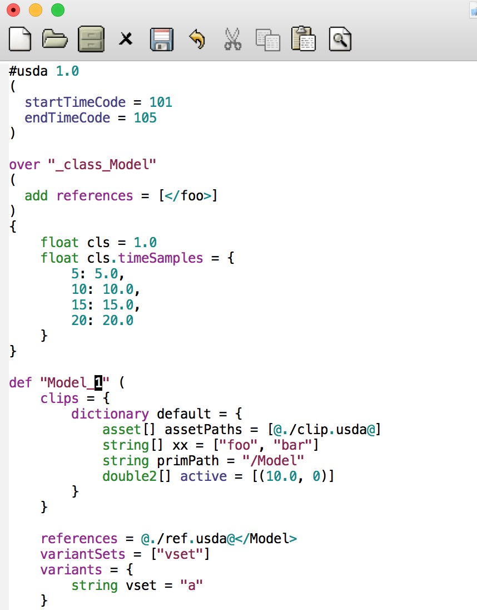
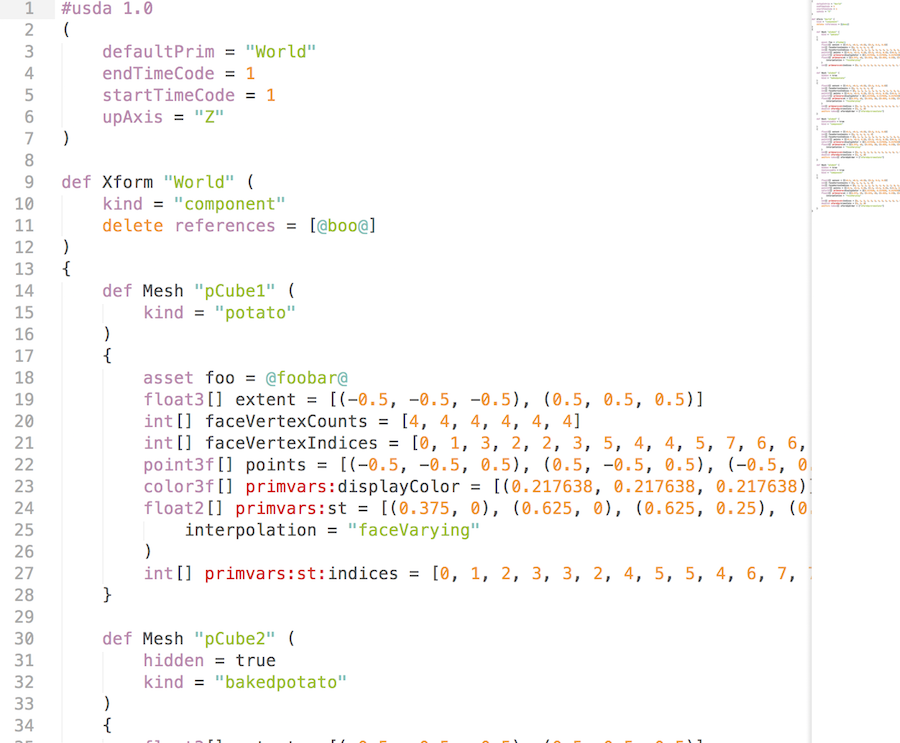
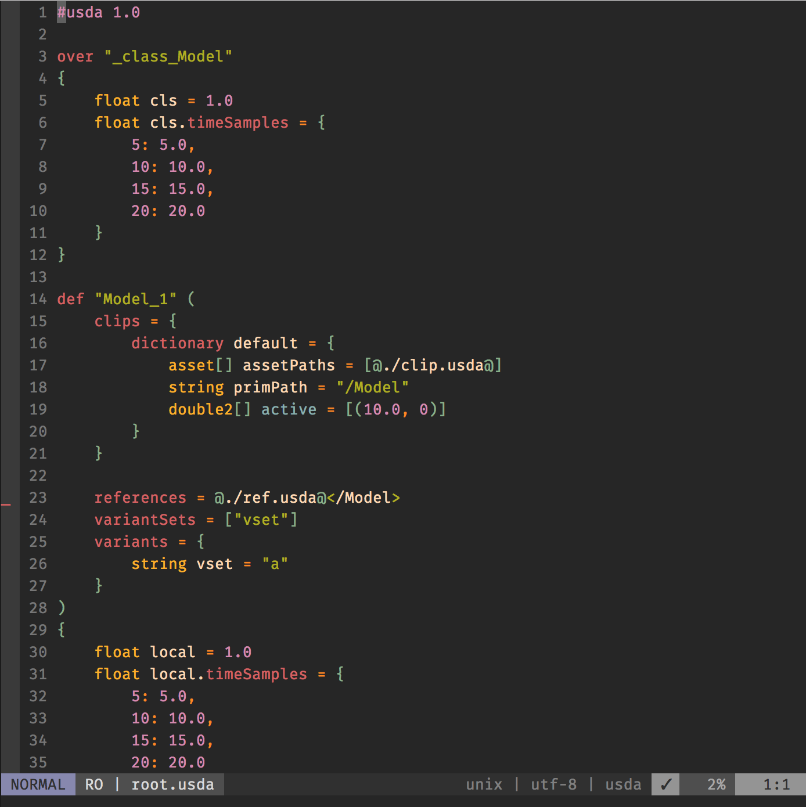

Nothing crazy, basic syntax highlighting in the common editors for the ascii
representation of USD (http://openusd.org) files. Contributors welcome, 
especially for anything that isn't vim.

- [emacs](https://github.com/superfunc/usda-syntax#emacs)
- [sublime](https://github.com/superfunc/usda-syntax#sublime)
- [vim](https://github.com/superfunc/usda-syntax#vim)

Looking for other editors(VSCode/Atom etc)? Check out https://github.com/vfxpro99/awesome-usd !

### emacs 

- Install: Add to emacs load script, launch with _<M-X>_ `usda-mode` 

- Example: 


### sublime

- Install: `cp sublime/usda-syntax.yaml <Sublime-Packages-Folder>/usda/usda.sublime-syntax`

- Example: 

### vim
- Install: Add the following block to `$MYVIMRC`, remembering to substitute
a real file path in place of `<LOCATION>`
```vim
au BufRead,BufNewFile *.usd set filetype=usda
au BufRead,BufNewFile *.usda set filetype=usda
autocmd FileType usda source <LOCATION>/usda-syntax/vim/usda.vim
```

- Example: 

### Disclaimer(s)

> This work is my sole effort and is in no way associated with or sponsored by my current, past, or future employer(s).


